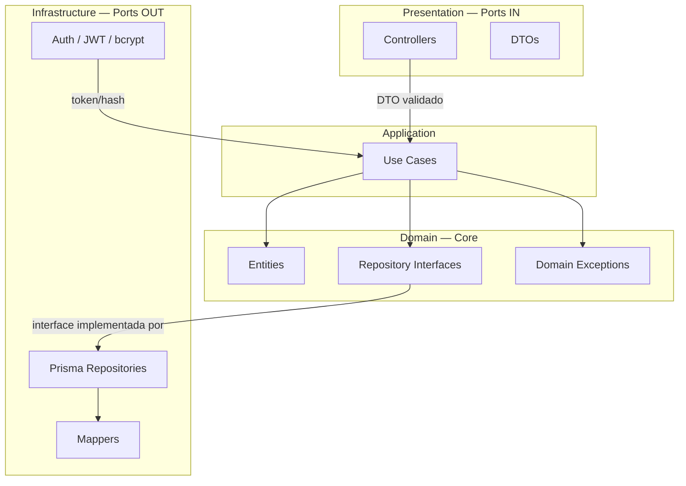
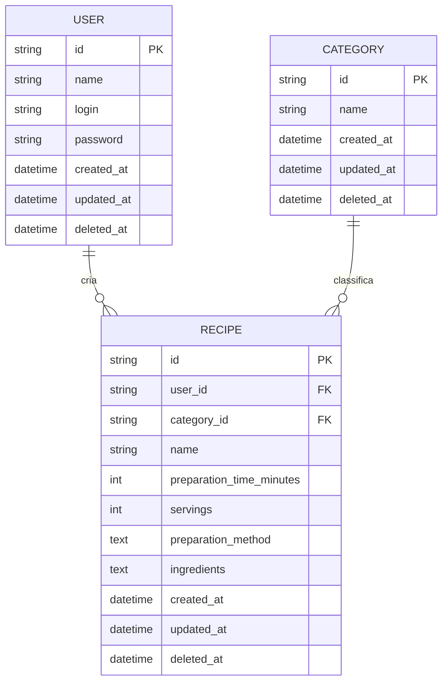
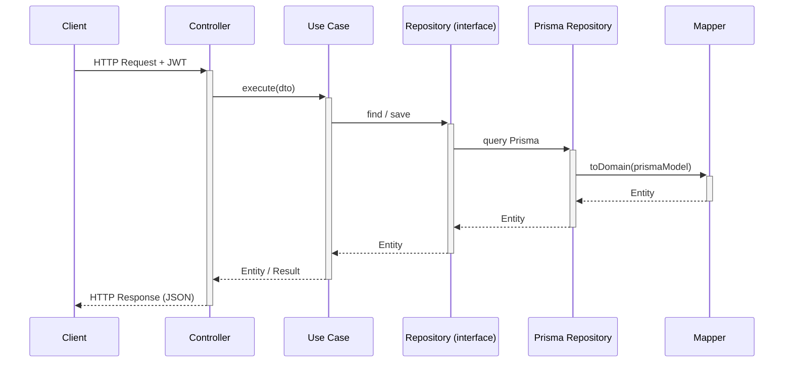
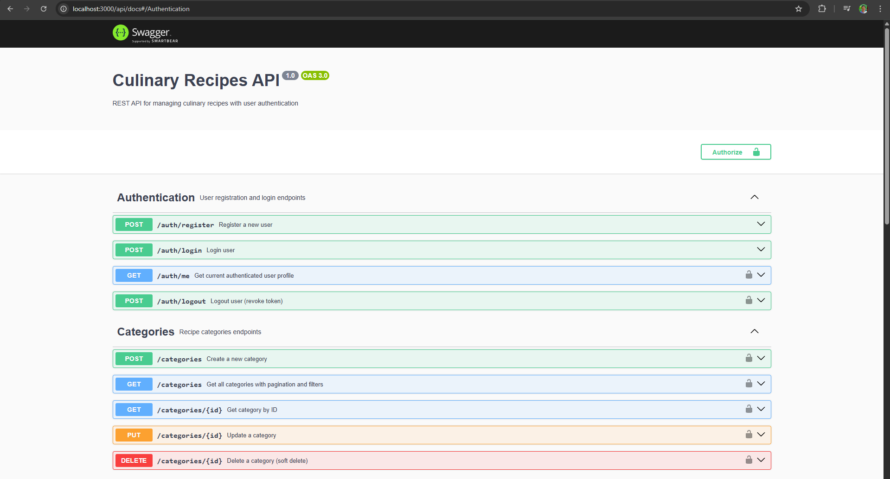
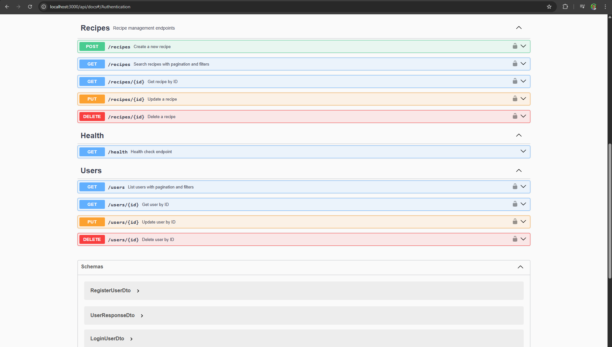
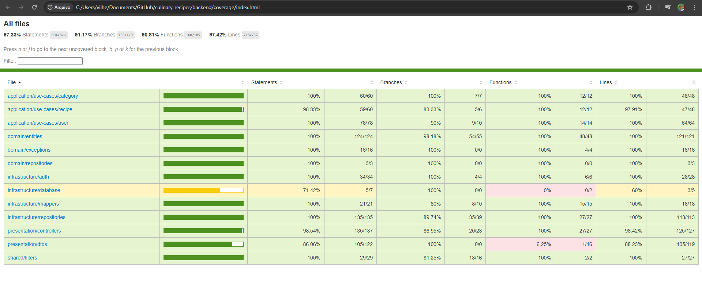
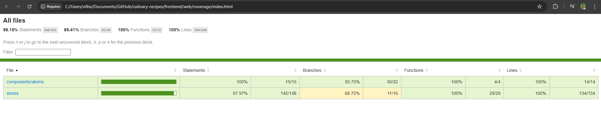

# Backend — Culinary Recipes API

REST API desenvolvida com **NestJS**, aplicando **Arquitetura Hexagonal (Ports & Adapters)**, **Domain-Driven Design (DDD)** e os princípios **SOLID** para garantir um código desacoplado, testável e fácil de evoluir.

---

## Stack

| Tecnologia     | Versão | Uso                            |
| -------------- | ------ | ------------------------------ |
| NestJS         | 10     | Framework principal            |
| Prisma         | 5      | ORM / migrations / seed        |
| MySQL          | 8.0    | Banco de dados relacional      |
| JWT + Passport | —      | Autenticação stateless         |
| bcrypt         | 5      | Hash de senhas                 |
| Swagger        | 7      | Documentação automática da API |
| Jest           | —      | Testes unitários e E2E         |

---

## Arquitetura

O projeto segue separação estrita em camadas:

```
src/
├── domain/             # Entidades, repositórios (interfaces), exceções de domínio
├── application/        # Use Cases (regras de negócio)
├── infrastructure/     # Implementações Prisma, Auth (JWT/bcrypt), Mappers
├── presentation/       # Controllers, DTOs (validação de entrada)
└── shared/             # Filtro global de exceções
```

### Diagrama — Arquitetura Hexagonal



### Boas práticas aplicadas

#### SOLID

| Princípio                     | Aplicação                                                                                           |
| ----------------------------- | --------------------------------------------------------------------------------------------------- |
| **S** — Single Responsibility | Cada Use Case tem uma única responsabilidade (ex.: `CreateRecipeUseCase`, `DeleteUserUseCase`)      |
| **O** — Open/Closed           | Novos recursos adicionam novos Use Cases sem alterar os existentes                                  |
| **L** — Liskov Substitution   | `PrismaUserRepository` substitui `UserRepository` (interface) sem quebrar contratos                 |
| **I** — Interface Segregation | Repositórios possuem contratos específicos por entidade                                             |
| **D** — Dependency Inversion  | Use Cases dependem de abstrações (`UserRepository`), não de implementações (`PrismaUserRepository`) |

#### DDD (Domain-Driven Design)

- **Entities** — `User`, `Category`, `Recipe` com identidade própria (UUID) e regras encapsuladas
- **Domain Exceptions** — exceções semânticas do domínio (`UserNotFoundException`, `InvalidCredentialsException`) separadas de erros de infraestrutura
- **Repository (Port)** — interfaces de repositório vivem no domínio; a infra apenas as implementa
- **Use Cases como Application Services** — orquestram entidades e repositórios sem lógica de framework
- **Mapper** — traduz entre o modelo de persistência (Prisma) e a entidade de domínio, mantendo o domínio puro

#### Outros padrões

- **Repository Pattern** — interfaces no domínio, implementações Prisma na infra
- **Mapper Pattern** — conversão entre entidade de domínio e modelo Prisma
- **Global Exception Filter** — respostas de erro padronizadas para toda a API
- **Soft Delete** — `deleted_at` em todas as entidades; nenhum dado é removido fisicamente

---

## Recursos da API

### Autenticação

| Método | Endpoint         | Descrição           |
| ------ | ---------------- | ------------------- |
| POST   | `/auth/register` | Cadastro de usuário |
| POST   | `/auth/login`    | Login — retorna JWT |

> Documentação interativa disponível em **http://localhost:3000/api/docs** (Swagger UI).

### Usuários _(requer JWT)_

| Método | Endpoint     | Descrição                            |
| ------ | ------------ | ------------------------------------ |
| GET    | `/users`     | Listagem paginada com busca          |
| GET    | `/users/:id` | Buscar por ID                        |
| PATCH  | `/users/:id` | Atualizar dados                      |
| DELETE | `/users/:id` | Soft delete (+ soft delete receitas) |

### Categorias _(requer JWT)_

| Método | Endpoint          | Descrição         |
| ------ | ----------------- | ----------------- |
| GET    | `/categories`     | Listagem paginada |
| GET    | `/categories/:id` | Buscar por ID     |
| POST   | `/categories`     | Criar categoria   |
| PATCH  | `/categories/:id` | Atualizar         |
| DELETE | `/categories/:id` | Soft delete       |

### Receitas _(requer JWT)_

| Método | Endpoint       | Descrição                                                 |
| ------ | -------------- | --------------------------------------------------------- |
| GET    | `/recipes`     | Busca paginada (filtros: nome, categoria, tempo, porções) |
| GET    | `/recipes/:id` | Buscar por ID                                             |
| POST   | `/recipes`     | Criar receita                                             |
| PATCH  | `/recipes/:id` | Atualizar                                                 |
| DELETE | `/recipes/:id` | Soft delete                                               |

---

## Banco de dados

### Diagrama ER



### Modelo de dados

- **User** — `id`, `name`, `login` (único), `password` (hash), `created_at`, `updated_at`, `deleted_at`
- **Category** — `id`, `name` (único), `created_at`, `updated_at`, `deleted_at`
- **Recipe** — `id`, `user_id`, `category_id`, `name`, `preparation_time_minutes`, `servings`, `preparation_method`, `ingredients`, `created_at`, `updated_at`, `deleted_at`

### Soft Delete

Todas as entidades possuem `deleted_at`. Nenhum registro é removido fisicamente do banco. O delete de usuário realiza um soft delete atômico (transação) em todas as suas receitas antes de deletar o usuário.

### Índices compostos

Todos os índices colocam `deleted_at` como coluna líder para garantir que as queries com filtro soft-delete usem índice em vez de full scan:

| Índice                                   | Query coberta                     |
| ---------------------------------------- | --------------------------------- |
| `(deleted_at, created_at)`               | Listagem padrão ordenada por data |
| `(deleted_at, name)`                     | Filtro por nome com soft delete   |
| `(user_id, deleted_at)`                  | Receitas por usuário              |
| `(category_id, deleted_at)`              | Receitas por categoria            |
| `(deleted_at, preparation_time_minutes)` | Filtro por tempo de preparo       |
| `(deleted_at, servings)`                 | Filtro por porções                |

---

### Fluxo de uma requisição



---

## Testes

```bash
# Unitários (com cobertura)
npm run test:cov

# E2E
npm run test:e2e

# Todos
npm run test:all
```

Cobertura: use cases, entidades de domínio, repositórios, controllers e filtros de exceção.

---

## Desenvolvimento local

```bash
npm install
cp .env.example .env     # configurar DATABASE_URL e JWT_SECRET
npm run prisma:migrate
npm run prisma:seed
npm run start:dev
```

### Lint

```bash
npm run lint       # ESLint (reporta e corrige automaticamente)
```

### Formatação

```bash
npm run format     # Prettier (formata)
```

### Testes

```bash
npm run test           # Jest unitários
npm run test:watch     # Jest em modo watch
npm run test:cov       # Jest unitários com cobertura
npm run test:e2e       # Testes E2E
npm run test:e2e:cov   # Testes E2E com cobertura
npm run test:all       # Unitários + E2E com cobertura
```

---

## Screenshots

### Swagger UI





### Cobertura de testes




