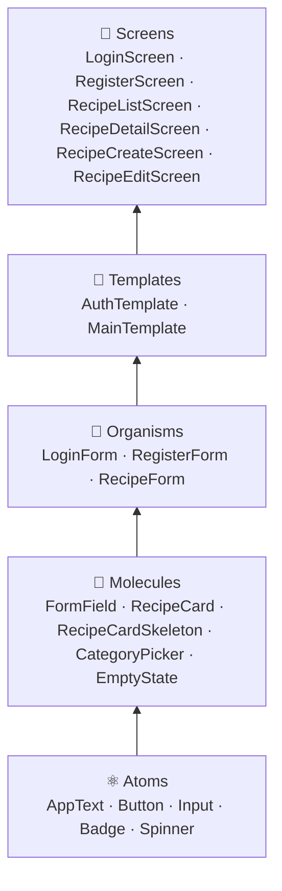
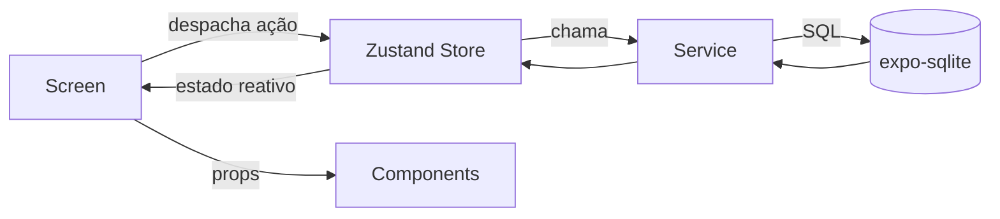
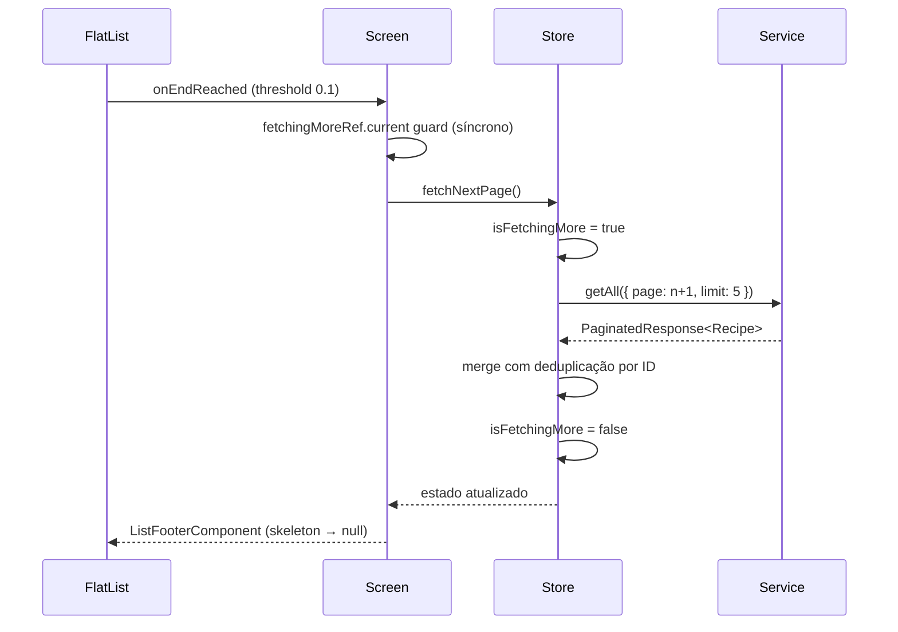
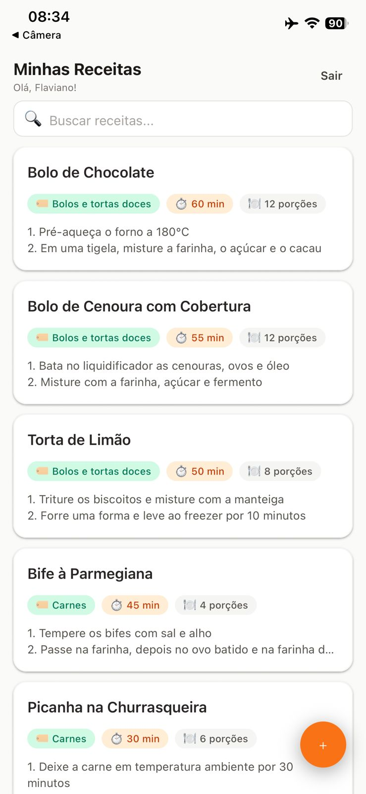
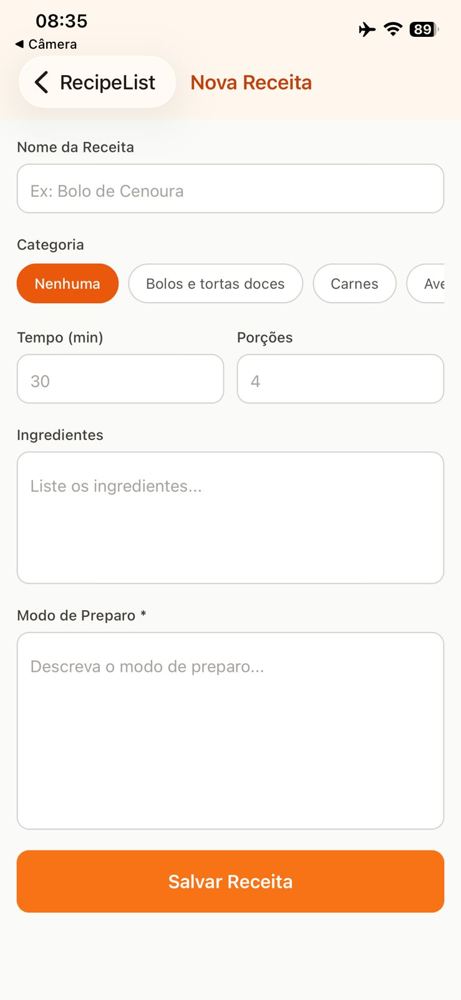
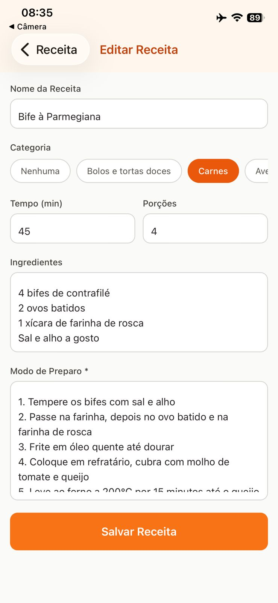
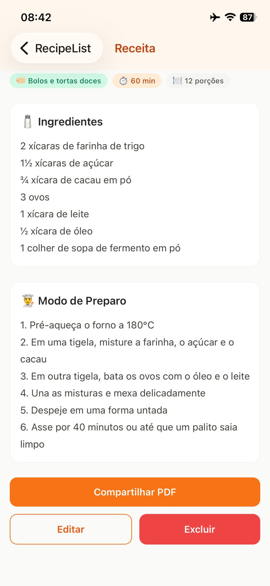
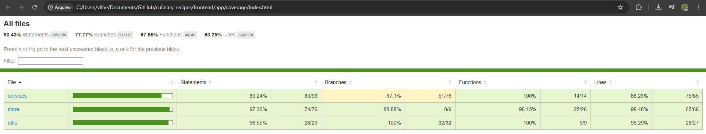

# Frontend Mobile — Culinary Recipes App

Aplicativo mobile desenvolvido com **React Native** e **Expo**, aplicando **Atomic Design** para organização de componentes, **NativeWind** para estilização declarativa e boas práticas de separação de responsabilidades entre screens, stores e services.

O app funciona **100% offline** — utiliza **expo-sqlite** como banco de dados local com suporte a WAL e transações, sem depender de nenhuma API externa.

---

## Quick Start

```bash
npm install
npx expo start --clear
```

Baixe o aplicativo **Expo Go** no seu celular ([Android](https://play.google.com/store/apps/details?id=host.exp.exponent) · [iOS](https://apps.apple.com/app/expo-go/id982107779)), abra-o e aponte a câmera para o **QR code** exibido no terminal.

---

## Stack

| Tecnologia            | Versão   | Uso                                     |
| --------------------- | -------- | --------------------------------------- |
| Expo SDK              | ~54.0.0  | Plataforma React Native gerenciada      |
| React Native          | 0.81.5   | Framework mobile (iOS + Android)        |
| TypeScript            | ~5.9.2   | Tipagem estática                        |
| NativeWind v4         | ^4.1.23  | Tailwind CSS para React Native          |
| Zustand               | ^5.0.3   | Gerenciamento de estado global          |
| React Hook Form + Zod | ^7 + ^3  | Formulários e validação tipada          |
| expo-sqlite           | ~16.0.10 | Banco de dados local (WAL, transações)  |
| expo-crypto           | ~15.0.8  | SHA-256 para hash de senha + randomUUID |
| expo-secure-store     | ~15.0.8  | Persistência segura da sessão (userId)  |
| React Navigation v6   | ^6       | Navegação tipada (native-stack)         |
| ESLint + Prettier     | —        | Qualidade e formatação de código        |

---

## Funcionalidades

### Autenticação

- Tela de login e cadastro
- Senha hasheada com **SHA-256** antes de persistir
- Sessão mantida via `expo-secure-store` (userId persistido entre reinicializações)
- Após cadastro, credenciais prefilled na tela de login via módulo de memória efêmera (sem expor senha em parâmetros de rota)

### Receitas

- Feed com **infinite scroll** estilo Instagram — carrega 5 receitas por vez
- **Skeleton screens** animados (pulse) durante carregamento inicial e paginação
- Busca por nome em tempo real com debounce via `fetchRecipes`
- Criar, editar e excluir receita
- Compartilhar receita como PDF via diálogo nativo (WhatsApp, e-mail, Drive, etc.)
- Seleção de categoria via picker horizontal com chips
- Campos de ingredientes e modo de preparo como área de texto multiline
- **Seed automático**: 20 receitas de exemplo criadas para todo novo usuário em uma única transação SQLite

### UX

- Pull-to-refresh na listagem
- Feedback de erro inline em todos os formulários
- Indicador de carregamento nos botões (estado `isSaving`)
- FAB (Floating Action Button) para criar nova receita

---

## Boas práticas aplicadas

### Atomic Design

Estrutura de componentes organizada em cinco níveis de abstração crescente:



### Separação de responsabilidades

| Camada         | Responsabilidade                                             |
| -------------- | ------------------------------------------------------------ |
| **Services**   | Acesso ao SQLite, lógica de persistência, mapeamento de rows |
| **Stores**     | Estado global reativo, orquestração das chamadas ao service  |
| **Screens**    | Orquestração — conectam store ↔ componentes                  |
| **Components** | Apresentação e UX, sem acesso direto ao store                |
| **Utils**      | Validators (Zod), error handling, módulos efêmeros           |

### Fluxo de dados



### Infinite scroll — arquitetura



---

## Estrutura do projeto

```
src/
├── components/
│   ├── atoms/          # AppText, Button, Input, Badge, Spinner
│   ├── molecules/      # FormField, RecipeCard, RecipeCardSkeleton, CategoryPicker, EmptyState
│   ├── organisms/      # LoginForm, RegisterForm, RecipeForm
│   └── templates/      # AuthTemplate, MainTemplate
├── constants/          # CATEGORIES (13 slugs), RECIPES_SEED (20 receitas)
├── database/           # Singleton expo-sqlite com guard de concorrência
├── hooks/              # useDebounce
├── navigation/         # RootNavigation, AppNavigator, AuthNavigator, navigationRef
├── screens/
│   ├── auth/           # LoginScreen, RegisterScreen
│   └── recipes/        # RecipeListScreen, RecipeDetailScreen, RecipeCreateScreen, RecipeEditScreen
├── services/           # auth.service.ts, recipe.service.ts
├── store/              # auth.store.ts, recipe.store.ts (Zustand)
├── types/              # Interfaces TypeScript globais
└── utils/              # validators.ts, errors.ts, pendingPrefill.ts
```

---

## Qualidade de código

- **ESLint** — `@typescript-eslint`, `react-hooks`, `react-native` rules
- **Prettier** — `singleQuote: true`, `trailingComma: "all"`, `printWidth: 100`
- **TypeScript strict** — `tsc --noEmit` com zero erros
- **Jest + jest-expo** — 78 testes, 0 falhas

### Cobertura de testes

| Módulo                    | Cenários cobertos                                                                                                  |
| ------------------------- | ------------------------------------------------------------------------------------------------------------------ |
| `utils/shareRecipePdf`    | Geração de HTML, categoria, ingredientes opcionais, campos nulos, erro de disponibilidade, propagação de erros     |
| `utils/validators`        | Schemas Zod: campos válidos, inválidos, coerção numérica, opcionais                                                |
| `utils/errors`            | Error, string, tipos desconhecidos (null, number, object)                                                          |
| `utils/pendingPrefill`    | Set, consume (limpa), overwrite, consume vazio                                                                     |
| `services/auth.service`   | register (cria, transação, duplicado), login (ok, user not found, senha errada), me, logout, getStoredUserId       |
| `services/recipe.service` | getAll (paginação, LIKE, totalPages, não autenticado), getById, create, update, remove                             |
| `stores/auth.store`       | initialize, login, register, logout (ok + erro), clearError                                                        |
| `stores/recipe.store`     | fetchRecipes, fetchNextPage (append + dedup + guards), fetchById, create, update, remove, clearCurrent, clearError |

---

## Desenvolvimento local

```bash
npm install
npm run start          # Expo Dev Server (escanear QR code com Expo Go)
npm run android        # Android emulator
npm run ios            # iOS simulator (macOS)
```

### Lint

```bash
npm run lint           # ESLint (report)
npm run lint:fix       # ESLint (corrige automaticamente)
```

### Formatação

```bash
npm run format         # Prettier (formata)
npm run format:check   # Prettier (verifica sem alterar)
```

### Testes

```bash
npm run test           # Jest (78 testes)
npm run test:watch     # Jest em modo watch
npm run test:coverage  # Jest com relatório de cobertura
```

---

## Screenshots

### Autenticação


### Receitas










### Cobertura de testes


