# Frontend — Culinary Recipes Web

SPA desenvolvida com **Vue 3** e **TypeScript**, aplicando **Atomic Design** para organização de componentes, **Composition API** para lógica reativa e reutilizável, e boas práticas de separação de responsabilidades entre views, stores e services.

---

## Stack

| Tecnologia        | Versão | Uso                                   |
| ----------------- | ------ | ------------------------------------- |
| Vue 3             | 3.4    | Framework reativo (Composition API)   |
| TypeScript        | 5.4    | Tipagem estática                      |
| Vite              | 5      | Build e dev server                    |
| Pinia             | 2      | Gerenciamento de estado               |
| Vue Router        | 4      | Roteamento SPA com navigation guard   |
| Axios             | 1.7    | Cliente HTTP (interceptors JWT + 401) |
| TailwindCSS       | 3.4    | Estilização utilitária                |
| ESLint + Prettier | —      | Qualidade e formatação de código      |

---

## Funcionalidades

### Autenticação

- Tela de login e registro
- Token JWT armazenado no `localStorage`
- Interceptor Axios injeta o token em todas as requisições
- Redirect automático para `/login` em respostas 401
- Navigation guard protege todas as rotas autenticadas

### Usuários

- Listagem paginada com busca por nome/login
- Criar usuário com validação de senha (barra de força + confirmação)
- Editar dados (nome, senha com confirmação opcional)
- Soft delete com confirmação

### Categorias

- Listagem paginada com busca por nome
- Criar, editar e excluir categorias
- Dropdown com todas as categorias em memória (usado nas receitas)

### Receitas

- Listagem paginada com múltiplos filtros: nome, categoria, tempo de preparo, porções
- Criar e editar receita com seleção de categoria via dropdown
- Soft delete com confirmação
- Exibição de tempo de preparo e porções formatados

### UX

- Sistema de **toast notifications** (canto superior direito) para confirmação de todas as ações
- Barra de força de senha em tempo real (componente reutilizável)
- Campo de confirmação de senha nos formulários de criação/edição
- Feedback de carregamento e tratamento de erros em todos os formulários

---

## Boas práticas aplicadas

### Atomic Design

Estrutura de componentes organizada em cinco níveis de abstração crescente:

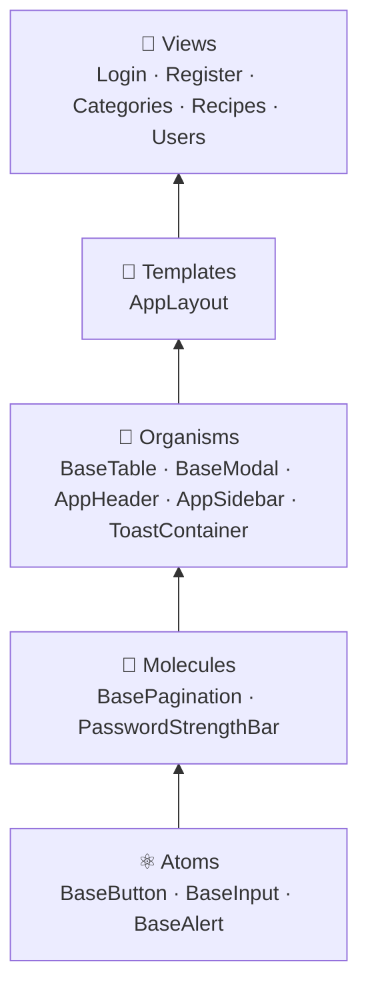

Cada nível é reutilizável e independente — as views apenas compõem os organismos e não contêm lógica de UI.

### Composition API

- **`<script setup>`** em todos os componentes — sem Options API
- **Composables** (`useToast`) encapsulam estado e lógica transversal reutilizável com `reactive` e `ref`
- **Computed properties** para derivar dados (ex.: força da senha, formatação de campos)
- **`watchEffect` / `watch`** nas views para reagir a mudanças de filtros e disparar buscas
- Stores Pinia escritas com **Composition Store** (`defineStore` + `ref` + `computed` + funções)

### Separação de responsabilidades

| Camada                                  | Responsabilidade                                       |
| --------------------------------------- | ------------------------------------------------------ |
| **Services** (`api.ts`, `*.service.ts`) | Comunicação HTTP, interceptors JWT e 401               |
| **Stores** (Pinia)                      | Estado global, cache de listagens, params de paginação |
| **Composables**                         | Lógica reutilizável transversal (toasts)               |
| **Components**                          | Apresentação e UX, sem acesso direto à API             |
| **Views**                               | Orquestração — conectam store ↔ componentes            |

### Fluxo de dados

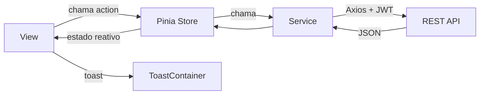

---

## Estrutura do projeto

```
src/
├── assets/           # Estilos globais (Tailwind entry)
├── components/       # Atomic Design (atoms → templates)
├── composables/      # useToast
├── router/           # Vue Router + navigation guard
├── services/         # api.ts (Axios), auth/category/recipe/user services
├── stores/           # Pinia stores (auth, category, recipe, user)
├── types/            # Interfaces TypeScript globais
└── views/            # LoginView, RegisterView, CategoriesView, RecipesView, UsersView
```

### Stores (Pinia)

Todos os stores seguem o padrão `_params ref` — o último conjunto de parâmetros de busca é persistido internamente para que a paginação mantenha os filtros ativos sem precisar repassar parâmetros.

---

## Qualidade de código

- **ESLint** — `plugin:vue/vue3-recommended` + `@vue/eslint-config-typescript`
- **Prettier** — `printWidth: 100`, `singleQuote: false`, `trailingComma: "all"`, `endOfLine: "lf"`
- **lint-staged** — formatação automática em pre-commit

---

## Build e produção

O frontend é servido por **nginx 1.27** em um container Docker multi-stage:

1. `node:20-alpine` — instala dependências e executa `vite build`
2. `nginx:1.27-alpine` — serve os assets estáticos

O nginx está configurado para:

- Redirecionar todas as rotas para `index.html` (SPA routing)
- Fazer proxy de `/api/*` → `http://api:3000/*` (sem expor a porta da API)

---

## Desenvolvimento local

```bash
npm install
npm run dev        # http://localhost:5173 (proxy /api → localhost:3000)
npm run build      # build de produção
npm run lint       # ESLint
npm run format     # Prettier
```

---

## Screenshots

### Autenticação

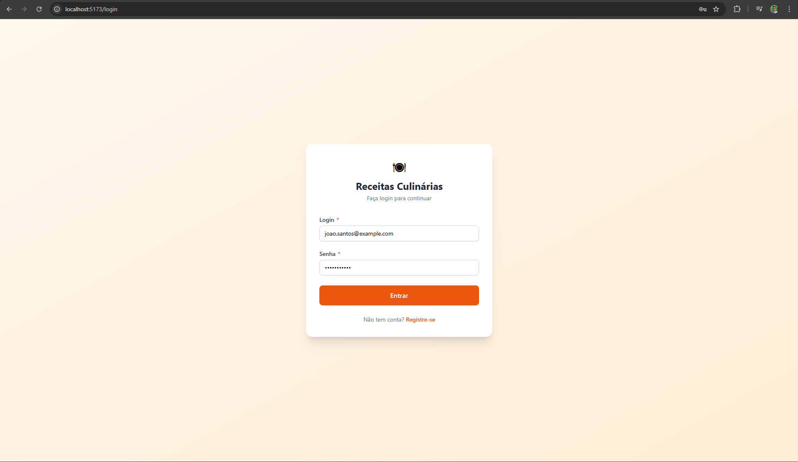

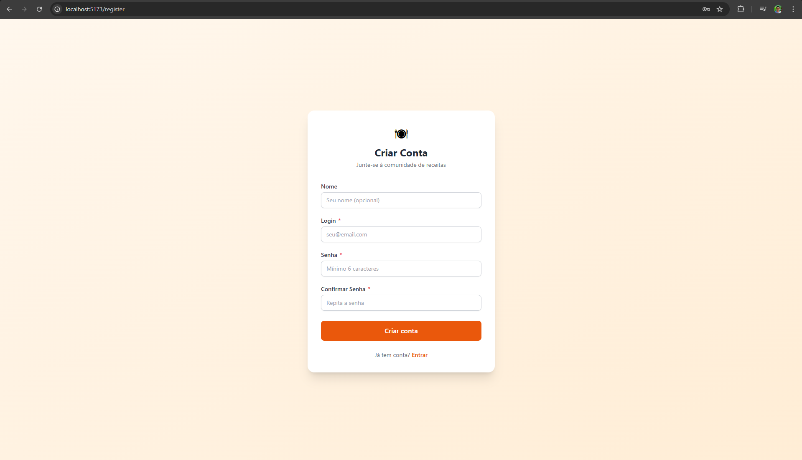

### Categorias

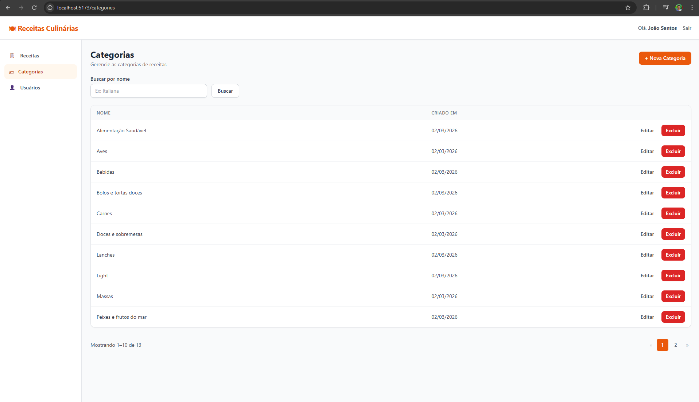

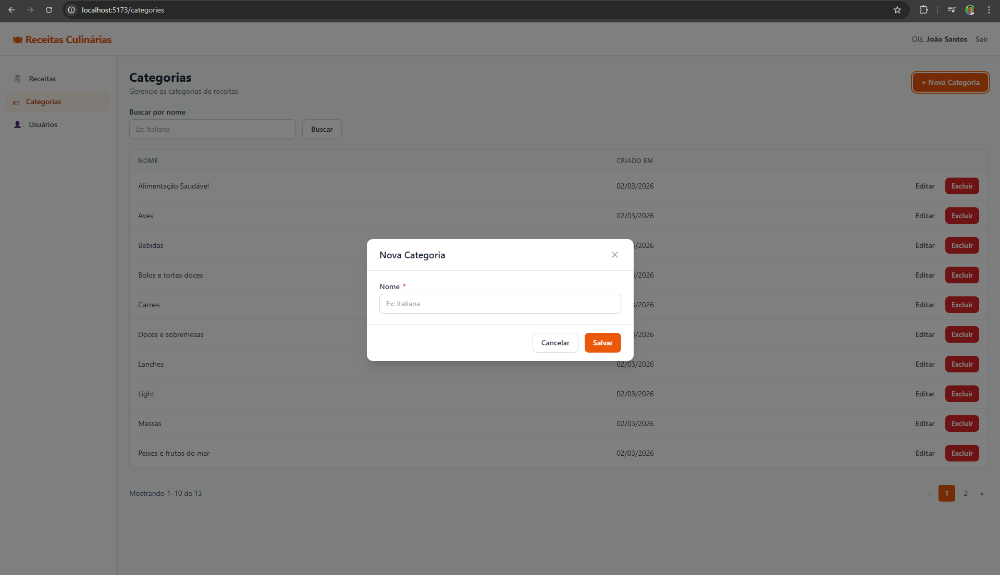

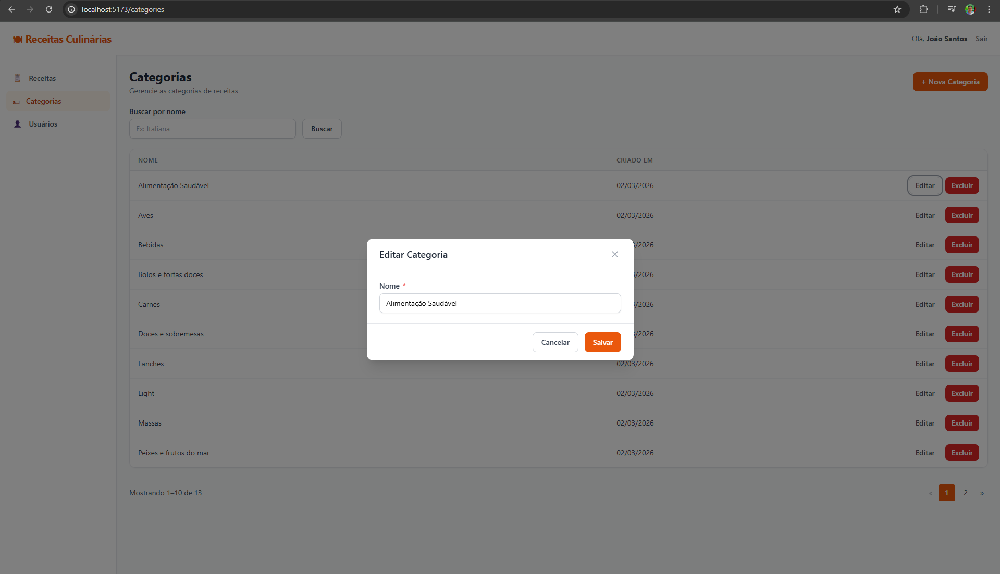

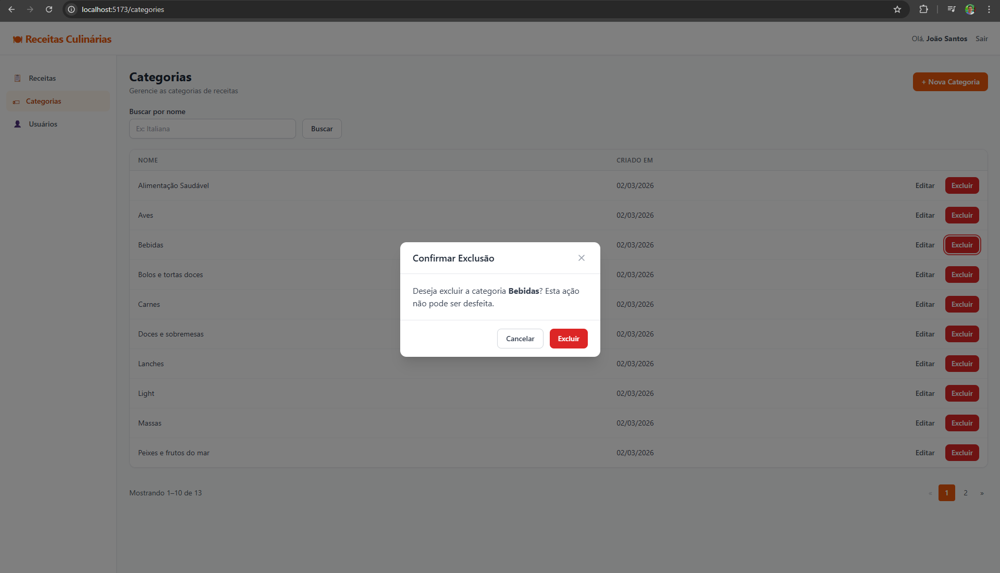

### Receitas

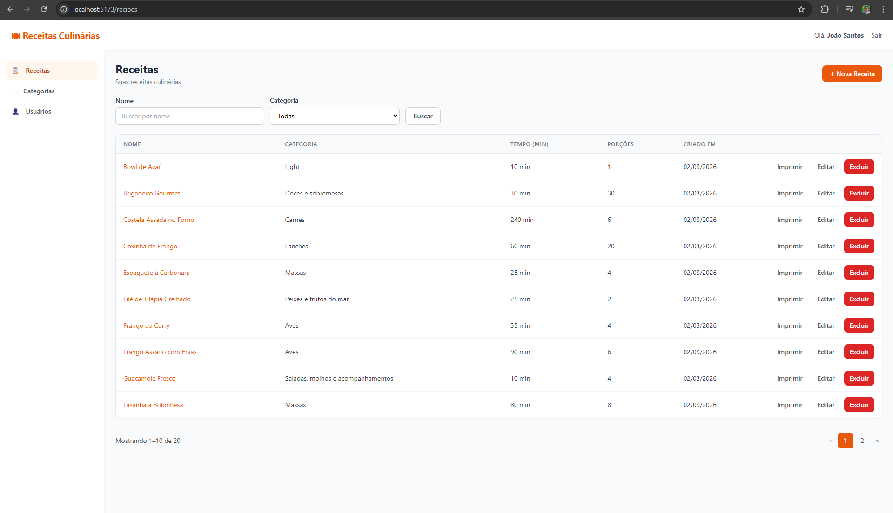

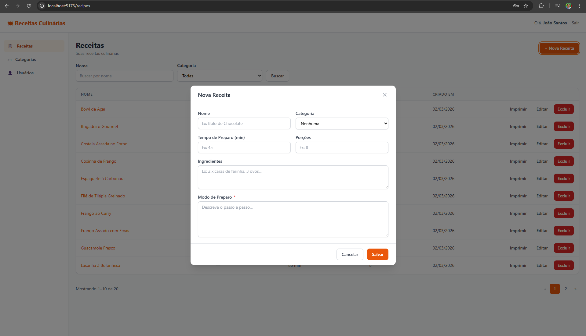

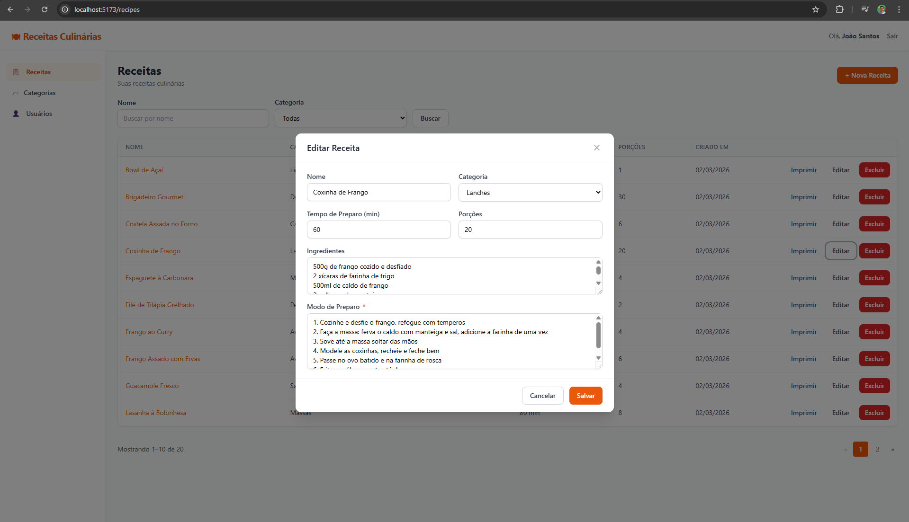

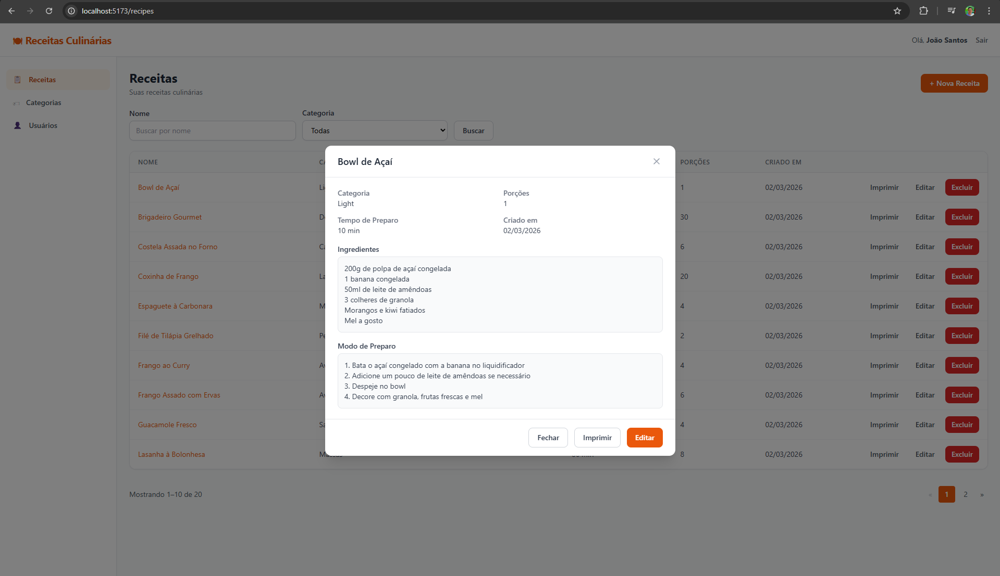

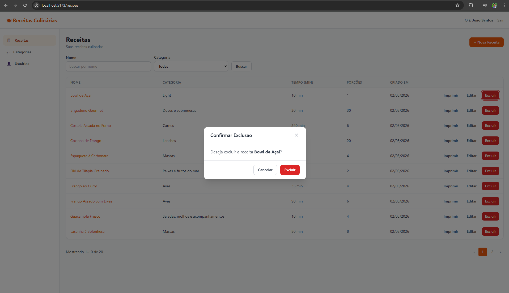

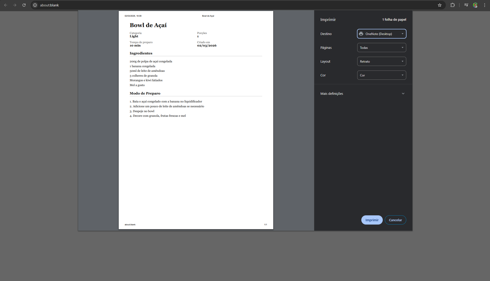

### Usuários

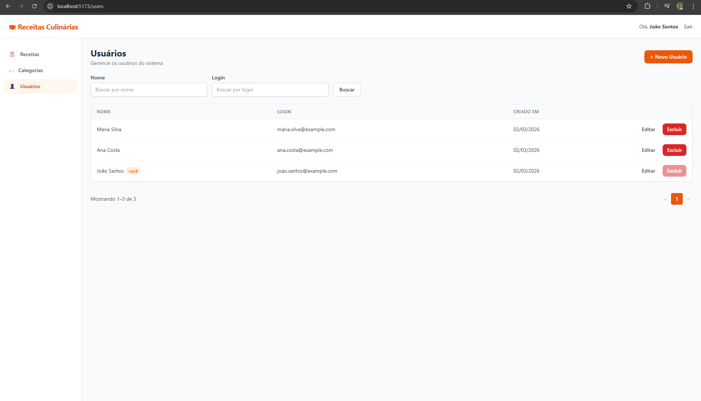

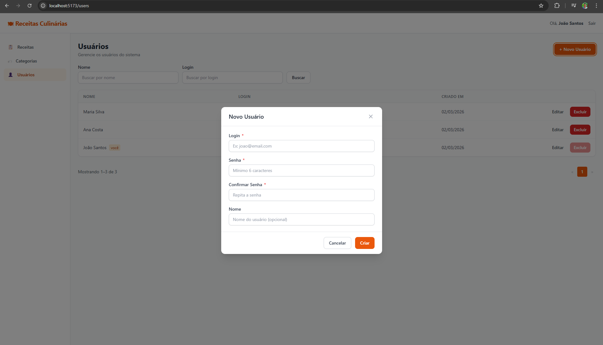

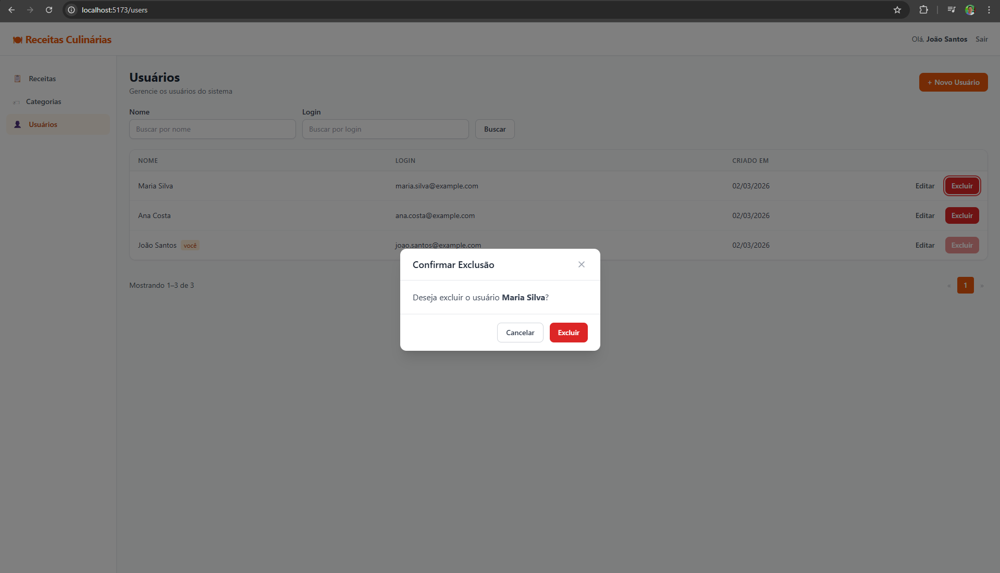
